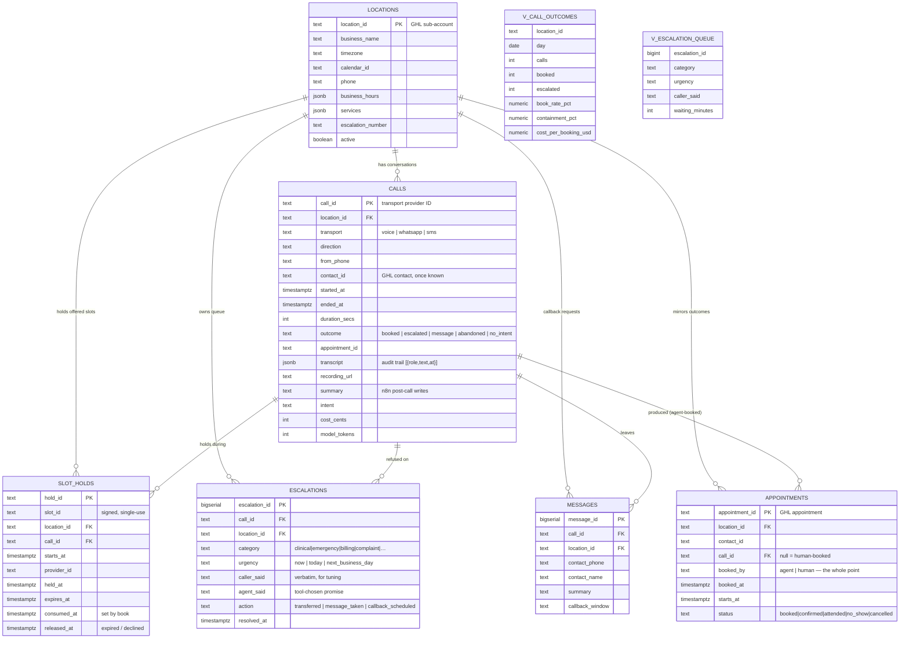

# Frontdesk — AI Receptionist That Books Into a Real Calendar

An AI receptionist for clinics that miss 30–40% of inbound calls (lunch, after hours, line busy). It answers on any transport, reads **real** availability, books the appointment, and — the part most demos skip — **knows which calls to hand to a human** and proves whether its bookings actually show up.

**Stack:** Next.js 15 serverless functions · Claude (Anthropic) · GoHighLevel / Cal.com / Mock calendars · Postgres (Neon) · n8n · Vercel

> 🔗 **Live API:** `https://<your-frontdesk>.vercel.app/api/agent`
> 🎥 **Demo video:** [paste Loom URL here — used in Conek tech application]
> ⚠️ **No paid keys?** Leave `ANTHROPIC_API_KEY` unset and the API runs in **demo mode**: rule-based booking over the same tools and signed slots, $0 spend. See §7.

---

## 1. The problem

A clinic paying for lead generation misses 30–40% of the calls those leads make. Every missed call is an appointment somebody already paid to generate and never received.

```
 inbound call ──▶ nobody answers ──▶ lead calls a competitor
                        │
                        ▼
 inbound call ──▶  frontdesk  ──▶ checks real availability
                        │      ──▶ books into GoHighLevel / Cal.com
                        │      ──▶ confirms by SMS
                        ▼
                  escalates to a human when it should
```

The gap isn't ad performance. It's that nobody picks up.

---

## 2. The two rules everything else is built around

**Rule 1 — the model may only offer slots the calendar API returned.** It never generates a time. A language model that can invent availability eventually books someone into a slot that doesn't exist — and a confidently wrong appointment is worse than a missed call, because the clinic finds out when the patient is at the desk. Enforcement is cryptographic (`lib/slots.ts` HMAC slot IDs), not just a prompt instruction.

**Rule 2 — nothing a caller waits on goes through n8n.** Voice has ~800ms round-trip budget. The realtime path is Vercel functions → calendar API directly. n8n owns everything asynchronous (post-call, escalation routing, reconciliation) where retries and visibility are worth the latency.

---

## 3. What it does

- Answers on first ring, day or night, on voice / WhatsApp / SMS through one endpoint
- `lookup_contact` first: returning patients are greeted by name, existing upcoming appointments checked
- `get_availability` → offers max 2 times → `hold_slot` the instant a time is spoken → `book_appointment` on accept
- `escalate_to_human` on clinical / emergency / billing / complaint / records / human-request — returns the *tool's* sentence, never an improvised promise
- `take_message` after hours or when the caller wants a callback
- Nightly sync compares **agent-booked vs human-booked show rate** — a booking isn't the product, a person walking in is

---

## 4. Database (ERD)

GoHighLevel is the source of truth for calendar, contact, and opportunity. This DB holds what GHL has no place for: **the conversation, the concurrency primitive, and the refusal record.**



Key constraints: partial unique index allows **at most one live hold per slot** (the double-book guard is in Postgres, not app logic); `calls` rows are append-only audit trail (redact in place, never delete); `escalations` is a first-class table because refusals get read weekly.

Schema: [`db/schema.sql`](db/schema.sql) · metrics: [`db/metrics.sql`](db/metrics.sql)

---

## 5. Project map

```
app/api/agent/route.ts      one turn on any transport (voice/WhatsApp/SMS POST here)
app/api/tools/              6 endpoints — the agent's entire capability surface:
  get-availability/           ONLY source of bookable times (signed slot IDs)
  hold-slot/                  reserve on OFFER, before caller agrees
  book-appointment/           spend hold → create booking (idempotent on hold)
  lookup-contact/             known caller? upcoming appointment?
  escalate/                   hand to human; urgency + promise chosen by hour
  take-message/               after-hours / callback requests
lib/calendar/               one interface, three backends:
  mock.ts                     zero-cost local slots (default when no keys)
  calcom.ts                   Cal.com API (free, what runs today)
  ghl.ts                      GoHighLevel API (adapter written, needs live account)
lib/slots.ts                HMAC slot signing — model cannot invent a time
lib/agent/run.ts            Claude loop (max 6 rounds, refusal-safe, terminal-tool stop)
lib/agent/demo.ts           rule-based loop — same tools, no LLM, $0
lib/agent/prompt.ts         system prompt (promises live in tools, not prompt)
lib/agent/tools.ts          tool schemas (strict) + endpoint routes
n8n/                        5 async workflows (never on call path):
  01-missed-call-rescue       GHL missed-call → quiet-hours/dedupe/rate/opt-out → agent
  02-post-call-processing     transcript → Claude extract → GHL fields → Slack
  03-escalation-router       urgency × hour → transfer / message / morning queue
  04-booking-failure-queue   failed books get their own workflow, not a catch block
  05-nightly-reconciliation   agent vs human show-rate + morning summary
test/run.mts                17 checks: slot crypto, Cal.com + GHL parsers
docs/                       00-ghl-foundation · 01-tool-contract · 02-escalation-policy · 03-build-order
```

---

## 6. API

**`POST /api/agent`** — `{ callId, message, transport, from, locationId? }` → `{ reply, outcome, appointmentId, toolCalls, mode }`. `outcome` is `in_progress | booked | escalated | message_taken`; `mode` is `claude | demo-rule-based`.

**Tool endpoints** (`POST /api/tools/*`) accept `{ callId, …tool args }` and return `{ ok, … }` or `{ ok:false, code, agentShouldSay }` — the caller always hears a human-written sentence on failure, never a model improvisation.

Live demo (against your Vercel URL):

```bash
# 1. Booking — offers 2 real times, holds the first
curl -s -X POST https://<frontdesk-url>/api/agent -H 'content-type: application/json' \
 -d '{"callId":"demo-1","transport":"whatsapp","from":"+15551234567","message":"Hi, need a new patient visit this week"}'
# 2. Same callId, accept — spends the hold, books
curl -s -X POST https://<frontdesk-url>/api/agent -H 'content-type: application/json' \
 -d '{"callId":"demo-1","transport":"whatsapp","from":"+15551234567","message":"Yes, book the first one"}'
# 3. Refusal — escalates, says only the tool's sentence
curl -s -X POST https://<frontdesk-url>/api/agent -H 'content-type: application/json' \
 -d '{"callId":"demo-2","transport":"whatsapp","from":"+15551234567","message":"Bad tooth pain, jaw swollen"}'
```

---

## 7. Modes & environment

| Var | Required | Purpose |
|---|---|---|
| `DATABASE_URL` | ✅ | Neon Postgres. Always required. |
| `SLOT_SIGNING_SECRET` | ✅ | HMAC secret for slot IDs. Any long random string. |
| `DEFAULT_LOCATION_ID` | ✅ | e.g. `loc_demo`. Must exist in `locations`. |
| `ANTHROPIC_API_KEY` | – | **Unset → demo mode** (rule-based, $0). Set → full Claude agent. |
| `CALCOM_API_KEY` / `CALCOM_EVENT_TYPE_ID` | – | Real calendar. Unset → mock calendar. |
| `CALENDAR_PROVIDER` | – | `mock` / `calcom` / `gohighlevel`. Auto-detects when empty. |
| `GHL_API_TOKEN` / `GHL_CALENDAR_ID` | – | Only for `gohighlevel` provider. |
| `N8N_ESCALATION_WEBHOOK_URL` | – | Fires on escalate. Optional for demo. |
| `LOCATION_TIMEZONE`, `APPOINTMENT_MINUTES`, `SLOT_HOLD_SECONDS` | – | Sensible defaults built in. |

Seed one location row before first call:

```sql
INSERT INTO locations (location_id, business_name, timezone, calendar_id)
VALUES ('loc_demo','Bright Smile Dental','America/New_York','cal_demo')
ON CONFLICT DO NOTHING;
```

---

## 8. Deploy to Vercel

Framework preset Next.js, root directory `/`, no build changes.

1. Import repo → add `DATABASE_URL`, `SLOT_SIGNING_SECRET`, `DEFAULT_LOCATION_ID` (Production). Add `ANTHROPIC_API_KEY` + `CALCOM_*` only if you have them — without them you get demo mode, which is the honest thing to show until you do.
2. Deploy → redeploy after env changes.
3. `psql "$DATABASE_URL" -f db/schema.sql -f db/metrics.sql`, insert the location row, hit each endpoint once (cold starts stall on camera otherwise).

Verify: `npm run typecheck`, `npm test` (17/17), `next build`.

---

## 9. Hard parts (kept here, not buried)

| Problem | Approach |
|---|---|
| Hallucinated availability | Signed slot IDs; `book-appointment` refuses anything it didn't issue |
| Two callers, one slot | Hold-on-offer + partial unique index; 409 returns fresh alternatives |
| Latency (~800ms voice budget) | Availability from cache; only the booking call hits the provider live; n8n never on call path |
| Clinical liability | Hard stop + transfer; "that sounds fine" is advice the agent has no basis to give |
| Cost per call | Voice $0.05–0.15/min tracked in `calls.cost_cents`; `v_call_outcomes.cost_per_booking_usd` keeps it visible |

## 10. Measurement

`05-nightly-reconciliation` syncs GHL statuses into `appointments` and publishes **agent-booked vs human-booked show rate**. Publish it even when unflattering — if agent bookings attend worse, that's the most useful thing the system can tell you.

---

Built by [Abdiwahid Ali](https://github.com/maqbuuul). Nairobi.
