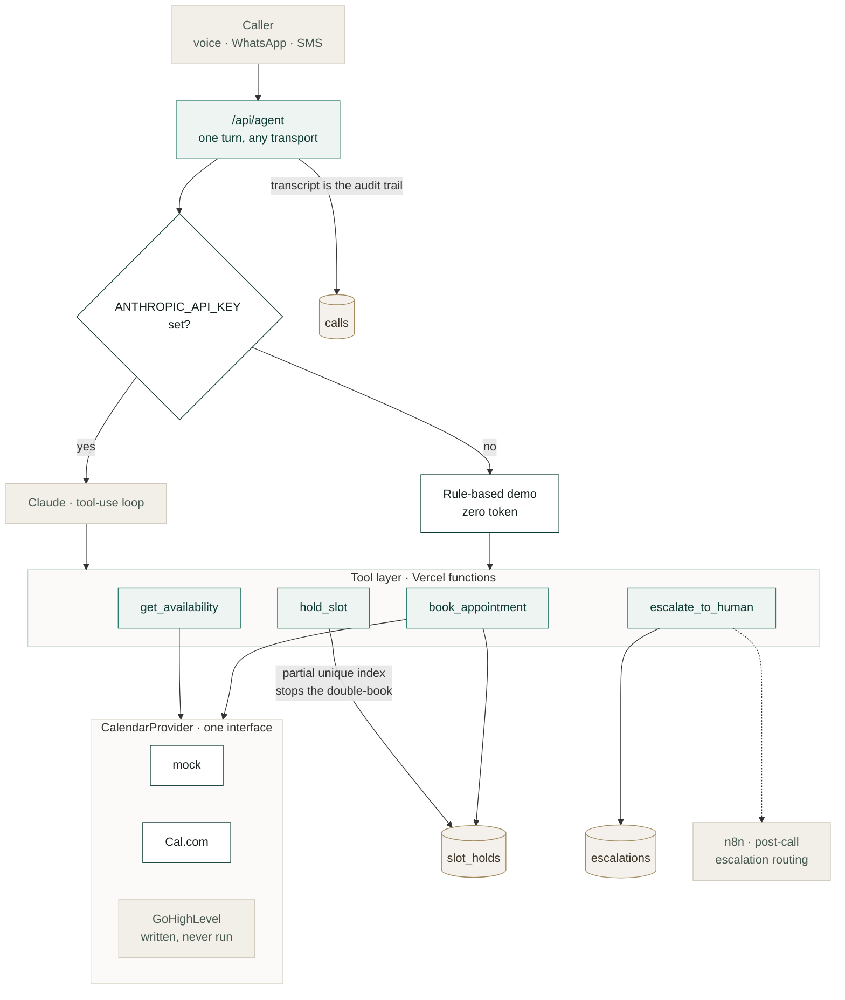

# Frontdesk

**An AI receptionist that answers the phone, checks a real calendar, books the
appointment — and knows which calls it has no business handling.**

[](https://nextjs.org)
[](https://typescriptlang.org)
[](https://docs.anthropic.com)
[](https://neon.tech)
[](https://vercel.com)
[](https://n8n.io)
[](test/run.mts)
[](LICENSE)

> **No paid keys?** Leave `ANTHROPIC_API_KEY` unset and it runs in **demo mode** —
> rule-based booking over the same tools and the same signed slots, at zero cost.

---

## The problem

A clinic that pays for lead generation misses 30–40% of the calls those leads
make. Lunch, after hours, already on the phone. Every missed call is an
appointment somebody already paid to generate and never received.

The gap isn't ad performance. It's that nobody picks up.

## Architecture



## The rule, enforced three times

**The model may only offer slots the calendar API returned.**

It is stated in the prompt. But prompts drift between model versions, and a
determined caller can talk a model into most things — so it is also enforced
where it cannot be argued with:

| Layer | Mechanism |
|---|---|
| Prompt | The system prompt says it in the first section |
| Schema | `strict: true` on every tool rejects malformed arguments |
| Signature | Slot ids carry an HMAC; `book_appointment` refuses any it did not issue |

A model that invents a time produces a signature failure, not an appointment.

## Two more decisions worth defending

**The escalation line comes from the tool, not the model.** `escalate_to_human`
returns a `toldCaller` sentence and the prompt says to say that and nothing more.
What the practice promises depends on staffing and the hour — a prompt promising
"within the hour" at 9pm has made a promise nobody can keep.

**Nothing a caller waits on goes through n8n.** Voice has roughly an 800 ms
round-trip budget. The realtime path is Vercel functions straight to the calendar
API; n8n owns the asynchronous work, where its retries and visibility are worth
the latency they cost. Tools chosen by constraint, not preference.

## Demo mode

`ANTHROPIC_API_KEY` unset switches `/api/agent` to a rule-based agent over the
**same tool endpoints and the same signed slots**, with a mock calendar. It
books, and it escalates on clinical or billing language. No tokens, no keys.

That exists so the project can be demonstrated honestly before anyone pays for
an API key — not as a stub that pretends.

## On the GoHighLevel adapter

`lib/calendar/ghl.ts` is **written against the documented API and has never been
run against a live account.** GoHighLevel's trial requires a card, and mine are
declined for US SaaS from Kenya.

That constraint is exactly why the calendar sits behind an interface. Cal.com is
what runs; the GHL adapter swaps in with one environment variable. The file lists
the three things to verify first when an account exists — response shape,
timezones, and whether a duplicate booking returns 409.

## Run it

```bash
npm install
cp .env.example .env
psql "$DATABASE_URL" -f db/schema.sql
npm run dev
```

```bash
curl -s -X POST localhost:3000/api/agent -H 'content-type: application/json' \
  -d '{"callId":"demo-1","transport":"whatsapp","from":"+15551234567",
       "message":"I need to book a new patient appointment this week"}'
```

Then the one that matters more:

```bash
curl -s -X POST localhost:3000/api/agent -H 'content-type: application/json' \
  -d '{"callId":"demo-2","transport":"whatsapp","from":"+15551234567",
       "message":"I have bad tooth pain and my jaw is swollen"}'
```

It escalates rather than books, and returns the sentence the *tool* chose.

## Read before changing anything

| Doc | |
|---|---|
| [`docs/01-tool-contract.md`](docs/01-tool-contract.md) | The six tools, and what they refuse |
| [`docs/02-escalation-policy.md`](docs/02-escalation-policy.md) | The calls a machine has no business handling |
| [`docs/03-build-order.md`](docs/03-build-order.md) | What "done" means at each stage |
| [`docs/00-ghl-foundation.md`](docs/00-ghl-foundation.md) | The account it books into |

## Status

| | |
|---|---|
| ✅ | Calendar interface, Cal.com + mock + GoHighLevel adapters |
| ✅ | Signed slot ids, slot holds, six tool endpoints |
| ✅ | The agent — prompt, tool schemas, loop, escalation short-circuit |
| ✅ | Demo mode, 17 tests, typecheck, production build |
| ⬜ | Console |
| ⬜ | The five n8n workflows |

## Verified

```
tsc --noEmit    exit 0
npm test        17/17 — signing, tampering, expiry, both providers' shapes
next build      /api/agent + 6 tool endpoints
```

The signing tests are the ones that matter: an invented slot id, a tampered
payload, a signature from a rotated secret and a stale offer are each refused.

---

Built by [Abdiwahid Ali](https://github.com/maqbuuul). Nairobi.
